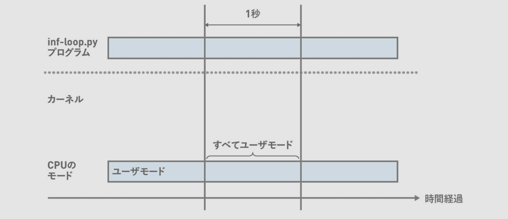
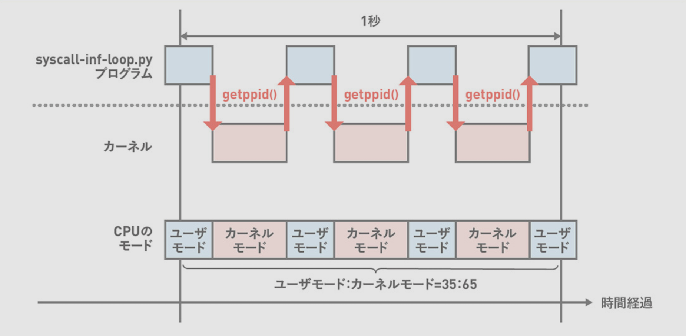
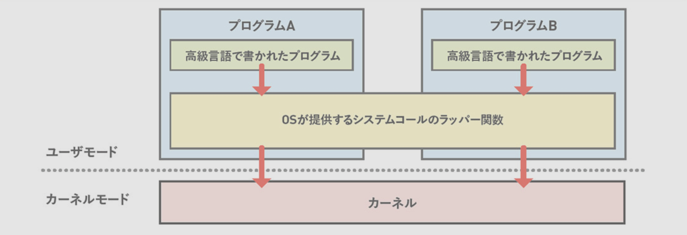

1章 Linuxの概要
---


```bash
cd chapter1
```

# システムコール発行の可視化

goでサンプルスクリプトを作る

```bash
go build -o chapter1/dst/ chapter1/src/01_hello.go 
./chapter1/dst/01_hello
# Hello, World
```

`strace` コマンドで発行されたシステムコールを確認

```bash
strace -o chapter1/dst/01_hello.log chapter1/dst/01_hello
less chapter1/dst/01_hello.log
# ...
# write(1, "Hello, World\n", 13)          = 13
# ...
```

`strace` の出力は1行が1つのシステムコールに対応しています。  
出力を確認すると `write()` システムコールによって `Hello, World\n` という文字列が表示されたことを確認できます。


# システムコールを処理している時間の割合

`sar -P 0 1 1` コマンドでCPUが実行している命令の割合を取得できます。

- `-P 0` : 対象のCPUコア
- `1` : 1秒ごとにデータを採取
- `1` : 1回だけデータを採取


```bash
sar -P 0 1 1
# Linux 6.8.0-1021-aws (ip-10-53-11-52)   03/17/25        _x86_64_        (2 CPU)
#
# 02:59:47        CPU     %user     %nice   %system   %iowait    %steal     %idle
# 02:59:48          0      1.01      0.00      0.00      0.00      0.00     98.99
# Average:          0      1.01      0.00      0.00      0.00      0.00     98.990
```

- ユーザーモードでプロセスを処理している割合: `%user` と `%nice` の合計
- カーネルがシステムコールを処理している割合: `%system`
- 何もしていないアイドル状態の割合: `%idle`


## ユーザーモードを100%使い切る

`taskset -c <論理CPU番号> <コマンド>` を利用すると指定したCPU上でコマンドを実行できる

```bash
taskset -c 0 python3 chapter1/src/02_inf_loop.py &
# [1] 3330856

sar -P 0 1 1
# Linux 6.8.0-1021-aws (ip-10-53-11-52)   03/17/25        _x86_64_        (2 CPU)
# 
# 03:44:24        CPU     %user     %nice   %system   %iowait    %steal     %idle
# 03:44:25          0    100.00      0.00      0.00      0.00      0.00      0.00
# Average:          0    100.00      0.00      0.00      0.00      0.00      0.00

kill 3330856
```



## システムモードを使う

```bash
taskset -c 0 python3 chapter1/src/03_syscall_inf_loop.py &
# [1] 3333472

sar -P 0 1 1
# Linux 6.8.0-1021-aws (ip-10-53-11-52)   03/17/25        _x86_64_        (2 CPU)
# 
# 03:47:37        CPU     %user     %nice   %system   %iowait    %steal     %idle
# 03:47:38          0     64.00      0.00     36.00      0.00      0.00      0.00
# Average:          0     64.00      0.00     36.00      0.00      0.00      0.00

kill 3333472
```




# 標準Cライブラリ

C言語にはISOによって定められた標準ライブラリがあり、Linuxではglibcを標準Cライブラリとして使用する。 (glibcを指して「libc」と表記する)  
C言語で書かれたほとんどすべてのCプログラムはlibcをリンクしており、 `ldd` コマンドを利用すると確認できる。

`libc.so.6` が標準Cライブラリを指します。

```bash
ldd /bin/echo
#         linux-vdso.so.1 (0x00007ffc0157b000)
#         libc.so.6 => /lib/x86_64-linux-gnu/libc.so.6 (0x00007de9dc800000)
#         /lib64/ld-linux-x86-64.so.2 (0x00007de9dca8b000)
```

## システムコールのラッパー関数

libcは標準Cライブラリだけではなく、システムコールのラッパー関数を提供している。  
※ システムコールはアーキテクチャ依存のアセンブリコードを使って呼び出すため、通常C言語などの高級言語からは直接呼び出せない。

x86_64アーキテクチャのCPUのgetppid()システムコール

```
mov  $0x6e,%eax
syscall
```

arm64アーキテクチャのCPUのgetppid()システムコール

```
mov x8,<システムコール番号>
syscall
```



## 静的ライブラリ・共有ライブラリ

- 静的ライブラリ: コンパイル時にライブラリを実行ファイルに組み込む
- 共有ライブラリ: 実行時にライブラリを読み込む


静的ライブラリである `libc.a` を利用する場合

- プログラムサイズは900KB程度
- 共有ライブラリはリンクされていない

```bash
cc -static -o chapter1/dst/pause chapter1/src/04_pause.c

# プログラムサイズは900KBほど
ll -h chapter1/dst/pause
# -rwxrwxr-x 1 ubuntu ubuntu 880K Mar 17 06:05 chapter1/dst/pause*

# 共有ライブラリはリンクされていない
ldd chapter1/dst/pause
#        not a dynamic executable
```


共有ライブラリを利用する場合

```bash
cc -o chapter1/dst/pause chapter1/src/04_pause.c

# プログラムサイズは16KBほど
ll -h chapter1/dst/pause
# -rwxrwxr-x 1 ubuntu ubuntu 16K Mar 17 06:09 chapter1/dst/pause*

# libc (/lib/x86_64-linux-gnu/libc.so.6) を動的リンクしている
ldd chapter1/dst/pause
#         linux-vdso.so.1 (0x00007ffd22181000)
#         libc.so.6 => /lib/x86_64-linux-gnu/libc.so.6 (0x000070965d000000)
#         /lib64/ld-linux-x86-64.so.2 (0x000070965d2a4000)
```