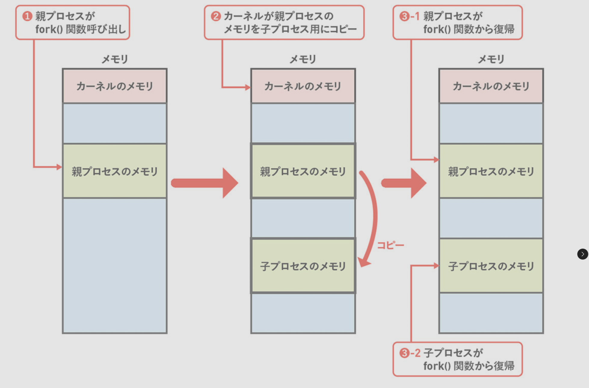
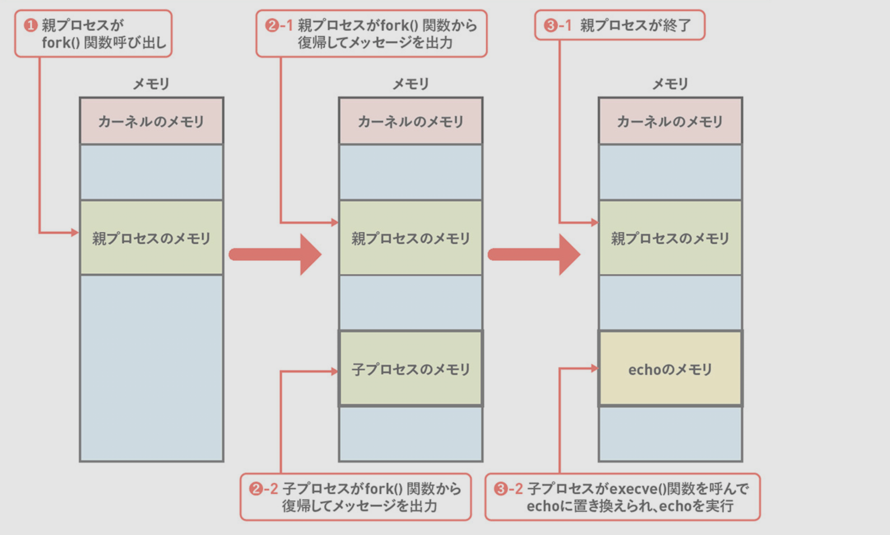
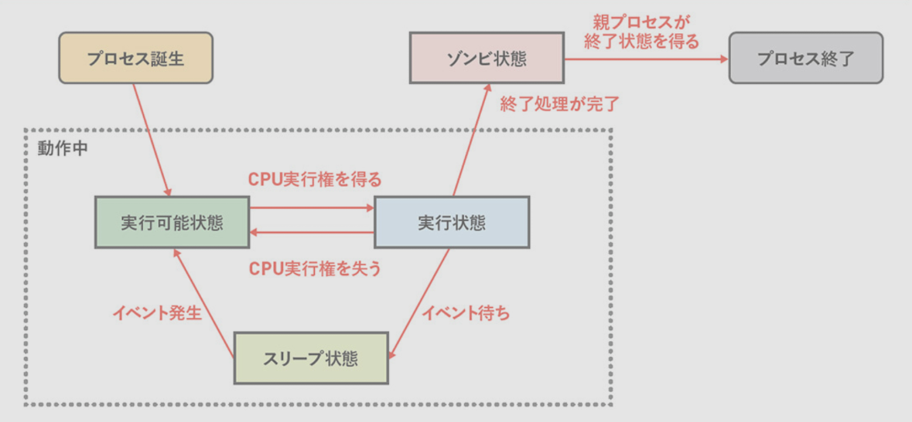
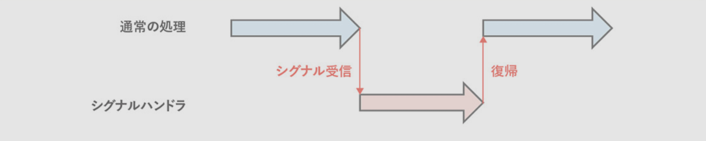
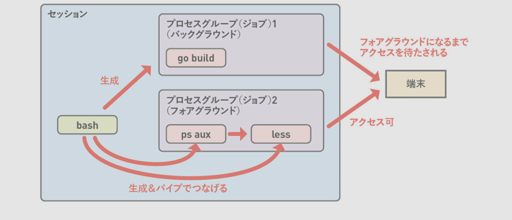
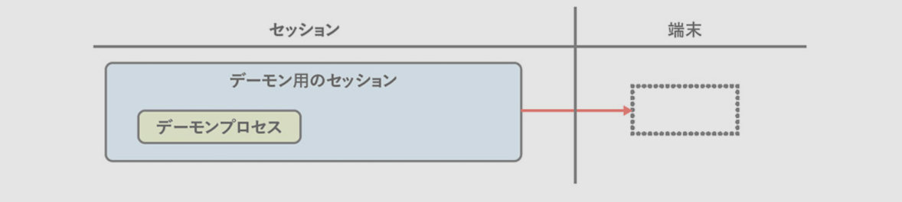

2章 プロセス管理 (基礎編)
---

# 同じプロセスを2つに分裂させるfork()関数

1. 親プロセスがfork()関数を呼び出す
2. fork()関数は親プロセスのメモリ空間をコピーして子プロセスを生成
3. 親プロセスには子プロセスのPIDが、子プロセスには0が返る

```bash
python3 chapter2/src/01_fork.py 
# 親プロセスのPID: 3449532, 子プロセスのPID: 3449533
# 子プロセスのPID: 3449533, 親プロセスのPID: 3449532
```



# 別のプログラムを起動するexecve()関数

1. execve()関数の呼び出し
2. execve()関数の引数に指定した実行ファイルからプログラムを読み出して、メモリ上に配置するために必要な情報を読み出す
3. 現在のプロセスのメモリ空間を読み出したプログラムの情報で上書きする
4. 新しいプロセスの最初に実行すべき命令(エントリーポイント)から実行を開始する


```bash
python3 chapter2/src/02_fork_and_exec.py
# 親プロセスのPID: 3452642, 子プロセスのPID: 3452643
# 子プロセスのPID: 3452643, 親プロセスのPID: 3452642
# PID=3452643 からこんにちは
```



# 別のプログラムを子プロセスとして起動するposix_spawn()関数

fork()とexecve()をひとまとめにしたような関数で、UNIX系OSのC言語インターフェース規格である **POSIX** に定義されている `posix_spawn()` 関数を使うと、子プロセスを立ち上げて別のプログラムを起動するといった一連の処理を簡素化できます。

※ fork()を呼び出したあと、execve()関数を呼び出すだけの場合にのみposix_spawn()を利用するのがおすすめ


```bash
python3 chapter2/src/04_posix_spawn.py
# echo コマンドを生成しました
# posix_spawn()によって生成されました
```

# 実行ファイルのフォーマット


execve()関数の実現のために、実行ファイルはプログラムのコードやデータに加えて次のようなプログラムの起動に必要なデータを保持しています

- コード領域のファイル上オフセット、サイズ、及びメモリマップ開始アドレス
- データ領域についての上記と同じ情報
- 最初に実行する命令のメモリアドレス

Linuxの実行ファイルがこれらの情報をどのように保持しているのかについて見てみましょう。  
Linuxの実行ファイルは通常**Executable and Linking Format(ELF)**というフォーマットになっています。  
ELFの各種情報は `readelf` コマンドで確認することができます。


```bash
# --no-pie:
#   PIE（Position Independent Executable）を無効にする
#   PIEが有効になっているとメモリ上のロードアドレスがランダム化される
$ cc -o chapter2/dst/pause -no-pie chapter2/src/03_pause.c
```

プログラムの開始アドレスを取得するには `readelf -h` を実行します。  
"Entry point address" の `0x401050` がこのプログラムのエントリポイントになります。

```bash

# -h --file-header: ファイルヘッダオプション
readelf -h chapter2/dst/pause
# ELF Header:
#   Magic:   7f 45 4c 46 02 01 01 00 00 00 00 00 00 00 00 00 
#   Class:                             ELF64
#   Data:                              2's complement, little endian
#   Version:                           1 (current)
#   OS/ABI:                            UNIX - System V
#   ABI Version:                       0
#   Type:                              EXEC (Executable file)
#   Machine:                           Advanced Micro Devices X86-64
#   Version:                           0x1
#   Entry point address:               0x401050
#   Start of program headers:          64 (bytes into file)
#   Start of section headers:          13912 (bytes into file)
#   Flags:                             0x0
#   Size of this header:               64 (bytes)
#   Size of program headers:           56 (bytes)
#   Number of program headers:         13
#   Size of section headers:           64 (bytes)
#   Number of section headers:         31
#   Section header string table index: 30
```

コードとデータのファイル内オフセット、サイズ、開始アドレスを取得するにはは `readelf -S` を実行します。
`.text` がコード領域、 `.data` がデータ領域となります。


```bash
# -S --section-headers: セクションヘッダオプション
readelf -S chapter2/dst/pause
# There are 31 section headers, starting at offset 0x3658:
# 
# Section Headers:
#   [Nr] Name              Type             Address           Offset
#        Size              EntSize          Flags  Link  Info  Align
#   [ 0]                   NULL             0000000000000000  00000000
#        0000000000000000  0000000000000000           0     0     0
#   [ 1] .interp           PROGBITS         0000000000400318  00000318
#        000000000000001c  0000000000000000   A       0     0     1
#   [ 2] .note.gnu.pr[...] NOTE             0000000000400338  00000338
#        0000000000000030  0000000000000000   A       0     0     8
#   [ 3] .note.gnu.bu[...] NOTE             0000000000400368  00000368
#        0000000000000024  0000000000000000   A       0     0     4
#   [ 4] .note.ABI-tag     NOTE             000000000040038c  0000038c
#        0000000000000020  0000000000000000   A       0     0     4
#   [ 5] .gnu.hash         GNU_HASH         00000000004003b0  000003b0
#        000000000000001c  0000000000000000   A       6     0     8
#   [ 6] .dynsym           DYNSYM           00000000004003d0  000003d0
#        0000000000000060  0000000000000018   A       7     1     8
#   [ 7] .dynstr           STRTAB           0000000000400430  00000430
#        0000000000000049  0000000000000000   A       0     0     1
#   [ 8] .gnu.version      VERSYM           000000000040047a  0000047a
#        0000000000000008  0000000000000002   A       6     0     2
#   [ 9] .gnu.version_r    VERNEED          0000000000400488  00000488
#        0000000000000030  0000000000000000   A       7     1     8
#   [10] .rela.dyn         RELA             00000000004004b8  000004b8
#        0000000000000030  0000000000000018   A       6     0     8
#   [11] .rela.plt         RELA             00000000004004e8  000004e8
#        0000000000000018  0000000000000018  AI       6    24     8
#   [12] .init             PROGBITS         0000000000401000  00001000
#        000000000000001b  0000000000000000  AX       0     0     4
#   [13] .plt              PROGBITS         0000000000401020  00001020
#        0000000000000020  0000000000000010  AX       0     0     16
#   [14] .plt.sec          PROGBITS         0000000000401040  00001040
#        0000000000000010  0000000000000010  AX       0     0     16
#   [15] .text             PROGBITS         0000000000401050  00001050
#        00000000000000fa  0000000000000000  AX       0     0     16
#   [16] .fini             PROGBITS         000000000040114c  0000114c
#        000000000000000d  0000000000000000  AX       0     0     4
#   [17] .rodata           PROGBITS         0000000000402000  00002000
#        0000000000000004  0000000000000004  AM       0     0     4
#   [18] .eh_frame_hdr     PROGBITS         0000000000402004  00002004
#        0000000000000034  0000000000000000   A       0     0     4
#   [19] .eh_frame         PROGBITS         0000000000402038  00002038
#        00000000000000a4  0000000000000000   A       0     0     8
#   [20] .init_array       INIT_ARRAY       0000000000403e10  00002e10
#        0000000000000008  0000000000000008  WA       0     0     8
#   [21] .fini_array       FINI_ARRAY       0000000000403e18  00002e18
#        0000000000000008  0000000000000008  WA       0     0     8
#   [22] .dynamic          DYNAMIC          0000000000403e20  00002e20
#        00000000000001d0  0000000000000010  WA       7     0     8
#   [23] .got              PROGBITS         0000000000403ff0  00002ff0
#        0000000000000010  0000000000000008  WA       0     0     8
#   [24] .got.plt          PROGBITS         0000000000404000  00003000
#        0000000000000020  0000000000000008  WA       0     0     8
#   [25] .data             PROGBITS         0000000000404020  00003020
#        0000000000000010  0000000000000000  WA       0     0     8
#   [26] .bss              NOBITS           0000000000404030  00003030
#        0000000000000008  0000000000000000  WA       0     0     1
#   [27] .comment          PROGBITS         0000000000000000  00003030
#        000000000000002b  0000000000000001  MS       0     0     1
#   [28] .symtab           SYMTAB           0000000000000000  00003060
#        0000000000000330  0000000000000018          29    18     8
#   [29] .strtab           STRTAB           0000000000000000  00003390
#        00000000000001a5  0000000000000000           0     0     1
#   [30] .shstrtab         STRTAB           0000000000000000  00003535
#        000000000000011f  0000000000000000           0     0     1
# Key to Flags:
#   W (write), A (alloc), X (execute), M (merge), S (strings), I (info),
#   L (link order), O (extra OS processing required), G (group), T (TLS),
#   C (compressed), x (unknown), o (OS specific), E (exclude),
#   D (mbind), l (large), p (processor specific)
```

### まとめ

- 実行ファイルは複数の領域に分けられており、それぞれを**セクション**と呼ぶ
- セクションの情報は2行を1組として表示される
- 数値はすべて16進数
- セクションの主な情報
  - `Name` : セクション名 (`.text`=コードセクション, `.data`=データセクション)
  - `Address` : メモリマップ開始アドレス
  - `Offset` : ファイル内オフセット
  - `Size` : サイズ


| 項目 | コードセクション | データセクション |
| --- | --- | --- |
| メモリマップの開始アドレス | `401050` | `404020` |
| サイズ | `fa` | `10` |
| ファイル内オフセット | `1050` | `3020` |


## メモリマップを確認する

プログラムから作成したプロセスのメモリマップは `/proc/<pid>/maps` というファイルから確認できます。  
コード領域、データ領域の「メモリマップの開始アドレス ~ サイズ」がメモリマップの範囲内に収まっていることがわかります。


```bash
./chapter2/dst/pause &
# [1] 3482917
cat /proc/3482917/maps
# 00400000-00401000 r--p 00000000 103:01 9844161           /home/ubuntu/Projects/book-how-linux-works/chapter2/dst/pause
# 00401000-00402000 r-xp 00001000 103:01 9844161           /home/ubuntu/Projects/book-how-linux-works/chapter2/dst/pause  ★ コード領域
# 00402000-00403000 r--p 00002000 103:01 9844161           /home/ubuntu/Projects/book-how-linux-works/chapter2/dst/pause
# 00403000-00404000 r--p 00002000 103:01 9844161           /home/ubuntu/Projects/book-how-linux-works/chapter2/dst/pause
# 00404000-00405000 rw-p 00003000 103:01 9844161           /home/ubuntu/Projects/book-how-linux-works/chapter2/dst/pause  ★ データ領域
# 7fc891400000-7fc891428000 r--p 00000000 103:01 12186     /usr/lib/x86_64-linux-gnu/libc.so.6
# 7fc891428000-7fc8915bd000 r-xp 00028000 103:01 12186     /usr/lib/x86_64-linux-gnu/libc.so.6
# 7fc8915bd000-7fc891615000 r--p 001bd000 103:01 12186     /usr/lib/x86_64-linux-gnu/libc.so.6
# 7fc891615000-7fc891616000 ---p 00215000 103:01 12186     /usr/lib/x86_64-linux-gnu/libc.so.6
# 7fc891616000-7fc89161a000 r--p 00215000 103:01 12186     /usr/lib/x86_64-linux-gnu/libc.so.6
# 7fc89161a000-7fc89161c000 rw-p 00219000 103:01 12186     /usr/lib/x86_64-linux-gnu/libc.so.6
# 7fc89161c000-7fc891629000 rw-p 00000000 00:00 0 
# 7fc89162c000-7fc89162f000 rw-p 00000000 00:00 0 
# 7fc891636000-7fc891638000 rw-p 00000000 00:00 0 
# 7fc891638000-7fc89163a000 r--p 00000000 103:01 12182     /usr/lib/x86_64-linux-gnu/ld-linux-x86-64.so.2
# 7fc89163a000-7fc891664000 r-xp 00002000 103:01 12182     /usr/lib/x86_64-linux-gnu/ld-linux-x86-64.so.2
# 7fc891664000-7fc89166f000 r--p 0002c000 103:01 12182     /usr/lib/x86_64-linux-gnu/ld-linux-x86-64.so.2
# 7fc891670000-7fc891672000 r--p 00037000 103:01 12182     /usr/lib/x86_64-linux-gnu/ld-linux-x86-64.so.2
# 7fc891672000-7fc891674000 rw-p 00039000 103:01 12182     /usr/lib/x86_64-linux-gnu/ld-linux-x86-64.so.2
# 7ffc92d1d000-7ffc92d3e000 rw-p 00000000 00:00 0          [stack]
# 7ffc92d4c000-7ffc92d50000 r--p 00000000 00:00 0          [vvar]
# 7ffc92d50000-7ffc92d52000 r-xp 00000000 00:00 0          [vdso]
# ffffffffff600000-ffffffffff601000 --xp 00000000 00:00 0  [vsyscall]
```


# ASLRによるセキュリティ強化

**Address Space Layout Randomization (ASLR)** はプログラムを実行するたびに各セクションを異なるアドレスにマップするという機能です。  
この機能があると、攻撃対象のコードやデータが特定のアドレスに存在することを前提とした攻撃が困難になります。

この機能を利用するには以下のような条件があります。

- カーネルのASLR機能が有効になっている (Ubuntu24.04ではデフォルトで有効)
- プログラムがASLRに対応している。このようなプログラムのことを **Position Independent Executable (PIE)** と呼びます。


プログラムが **PIE** であるかは `file` コマンドで確認できます。

```bash
# PIEではない
cc -o chapter2/dst/pause --no-pie chapter2/src/03_pause.c
file chapter2/dst/pause
# chapter2/dst/pause: ELF 64-bit LSB executable, x86-64, version 1 (SYSV), dynamically linked, interpreter /lib64/ld-linux-x86-64.so.2, BuildID[sha1]=ec06411baa14e1b922d22a8b7b75c546ca63f25b, for GNU/Linux 3.2.0, not stripped

# PIE
cc -o chapter2/dst/pause chapter2/src/03_pause.c
file chapter2/dst/pause
# chapter2/dst/pause: ELF 64-bit LSB pie executable, x86-64, version 1 (SYSV), dynamically linked, interpreter /lib64/ld-linux-x86-64.so.2, BuildID[sha1]=a88993fef6ed969eb7dcb1daf9cced12a8a1a0ec, for GNU/Linux 3.2.0, not stripped
```


`--no-pie` をつけずに普通にビルドしたpauseプログラムのメモリマップを確認すると、 1回目と2回目で全然異なる場所にメモリマップされていることがわかります。


```bash
cc -o chapter2/dst/pause chapter2/src/03_pause.c
./chapter2/dst/pause &
# [1] 3565621
cat /proc/3565621/maps
# 6025df9ad000-6025df9ae000 r--p 00000000 103:01 9844161                   /home/ubuntu/Projects/book-how-linux-works/chapter2/dst/pause
# 6025df9ae000-6025df9af000 r-xp 00001000 103:01 9844161                   /home/ubuntu/Projects/book-how-linux-works/chapter2/dst/pause
# 6025df9af000-6025df9b0000 r--p 00002000 103:01 9844161                   /home/ubuntu/Projects/book-how-linux-works/chapter2/dst/pause
# 6025df9b0000-6025df9b1000 r--p 00002000 103:01 9844161                   /home/ubuntu/Projects/book-how-linux-works/chapter2/dst/pause
# 6025df9b1000-6025df9b2000 rw-p 00003000 103:01 9844161                   /home/ubuntu/Projects/book-how-linux-works/chapter2/dst/pause
# 70f792e00000-70f792e28000 r--p 00000000 103:01 12186                     /usr/lib/x86_64-linux-gnu/libc.so.6
# 70f792e28000-70f792fbd000 r-xp 00028000 103:01 12186                     /usr/lib/x86_64-linux-gnu/libc.so.6
# 70f792fbd000-70f793015000 r--p 001bd000 103:01 12186                     /usr/lib/x86_64-linux-gnu/libc.so.6
# 70f793015000-70f793016000 ---p 00215000 103:01 12186                     /usr/lib/x86_64-linux-gnu/libc.so.6
# 70f793016000-70f79301a000 r--p 00215000 103:01 12186                     /usr/lib/x86_64-linux-gnu/libc.so.6
# 70f79301a000-70f79301c000 rw-p 00219000 103:01 12186                     /usr/lib/x86_64-linux-gnu/libc.so.6
# 70f79301c000-70f793029000 rw-p 00000000 00:00 0 
# 70f7930a2000-70f7930a5000 rw-p 00000000 00:00 0 
# 70f7930ac000-70f7930ae000 rw-p 00000000 00:00 0 
# 70f7930ae000-70f7930b0000 r--p 00000000 103:01 12182                     /usr/lib/x86_64-linux-gnu/ld-linux-x86-64.so.2
# 70f7930b0000-70f7930da000 r-xp 00002000 103:01 12182                     /usr/lib/x86_64-linux-gnu/ld-linux-x86-64.so.2
# 70f7930da000-70f7930e5000 r--p 0002c000 103:01 12182                     /usr/lib/x86_64-linux-gnu/ld-linux-x86-64.so.2
# 70f7930e6000-70f7930e8000 r--p 00037000 103:01 12182                     /usr/lib/x86_64-linux-gnu/ld-linux-x86-64.so.2
# 70f7930e8000-70f7930ea000 rw-p 00039000 103:01 12182                     /usr/lib/x86_64-linux-gnu/ld-linux-x86-64.so.2
# 7ffd4ae58000-7ffd4ae79000 rw-p 00000000 00:00 0                          [stack]
# 7ffd4aeb3000-7ffd4aeb7000 r--p 00000000 00:00 0                          [vvar]
# 7ffd4aeb7000-7ffd4aeb9000 r-xp 00000000 00:00 0                          [vdso]
# ffffffffff600000-ffffffffff601000 --xp 00000000 00:00 0                  [vsyscall]

kill 3565621


./chapter2/dst/pause &
# [1] 3568273
cat /proc/3568273/maps
# 58ceadb89000-58ceadb8a000 r--p 00000000 103:01 9844161                   /home/ubuntu/Projects/book-how-linux-works/chapter2/dst/pause
# 58ceadb8a000-58ceadb8b000 r-xp 00001000 103:01 9844161                   /home/ubuntu/Projects/book-how-linux-works/chapter2/dst/pause
# 58ceadb8b000-58ceadb8c000 r--p 00002000 103:01 9844161                   /home/ubuntu/Projects/book-how-linux-works/chapter2/dst/pause
# 58ceadb8c000-58ceadb8d000 r--p 00002000 103:01 9844161                   /home/ubuntu/Projects/book-how-linux-works/chapter2/dst/pause
# 58ceadb8d000-58ceadb8e000 rw-p 00003000 103:01 9844161                   /home/ubuntu/Projects/book-how-linux-works/chapter2/dst/pause
# 74c8ae200000-74c8ae228000 r--p 00000000 103:01 12186                     /usr/lib/x86_64-linux-gnu/libc.so.6
# 74c8ae228000-74c8ae3bd000 r-xp 00028000 103:01 12186                     /usr/lib/x86_64-linux-gnu/libc.so.6
# 74c8ae3bd000-74c8ae415000 r--p 001bd000 103:01 12186                     /usr/lib/x86_64-linux-gnu/libc.so.6
# 74c8ae415000-74c8ae416000 ---p 00215000 103:01 12186                     /usr/lib/x86_64-linux-gnu/libc.so.6
# 74c8ae416000-74c8ae41a000 r--p 00215000 103:01 12186                     /usr/lib/x86_64-linux-gnu/libc.so.6
# 74c8ae41a000-74c8ae41c000 rw-p 00219000 103:01 12186                     /usr/lib/x86_64-linux-gnu/libc.so.6
# 74c8ae41c000-74c8ae429000 rw-p 00000000 00:00 0 
# 74c8ae4b3000-74c8ae4b6000 rw-p 00000000 00:00 0 
# 74c8ae4bd000-74c8ae4bf000 rw-p 00000000 00:00 0 
# 74c8ae4bf000-74c8ae4c1000 r--p 00000000 103:01 12182                     /usr/lib/x86_64-linux-gnu/ld-linux-x86-64.so.2
# 74c8ae4c1000-74c8ae4eb000 r-xp 00002000 103:01 12182                     /usr/lib/x86_64-linux-gnu/ld-linux-x86-64.so.2
# 74c8ae4eb000-74c8ae4f6000 r--p 0002c000 103:01 12182                     /usr/lib/x86_64-linux-gnu/ld-linux-x86-64.so.2
# 74c8ae4f7000-74c8ae4f9000 r--p 00037000 103:01 12182                     /usr/lib/x86_64-linux-gnu/ld-linux-x86-64.so.2
# 74c8ae4f9000-74c8ae4fb000 rw-p 00039000 103:01 12182                     /usr/lib/x86_64-linux-gnu/ld-linux-x86-64.so.2
# 7ffc09c66000-7ffc09c87000 rw-p 00000000 00:00 0                          [stack]
# 7ffc09dd6000-7ffc09dda000 r--p 00000000 00:00 0                          [vvar]
# 7ffc09dda000-7ffc09ddc000 r-xp 00000000 00:00 0                          [vdso]
# ffffffffff600000-ffffffffff601000 --xp 00000000 00:00 0                  [vsyscall]
```

# プロセスの親子関係

コンピュータの電源をいれると次のような順序でシステムが初期化される

1. コンピュータの電源をいれる
2. BIOSやUEFIなどのファームウェアが起動してハードウェアを初期化する
3. ファームウェアがGRUBなどのブートローダーを起動する
4. ブートローダーがOSカーネルを起動する。 (Linuxカーネル)
5. Linuxカーネルがinitプロセスを起動する
6. initプロセスが子プロセスを起動して、子プロセスがさらにその子プロセスを起動、、、と続き、プロセスの木構造を作る


```bash
# -p, --show-pids: プロセスIDを表示する
pstree -p
# systemd(1)─┬─acpid(3334813)
#            ├─agent(3282225)─┬─{agent}(3282233)
#            │                ├─{agent}(3282234)
#            │                ├─{agent}(3282235)
#            │                ├─{agent}(3282238)
#            │                ├─{agent}(3282245)
#            │                ├─{agent}(3282246)
#            │                ├─{agent}(3282376)
#            │                ├─{agent}(3282377)
#            │                ├─{agent}(3282378)
#            │                └─{agent}(3282472)
#            ├─agetty(454)
#            ├─agetty(3334824)
#            ├─amazon-cloudwat(404)─┬─{amazon-cloudwat}(658)
#            │                      ├─{amazon-cloudwat}(659)
#            │                      ├─{amazon-cloudwat}(660)
#            │                      ├─{amazon-cloudwat}(737)
#            │                      ├─{amazon-cloudwat}(738)
#            │                      ├─{amazon-cloudwat}(766)
#            │                      └─{amazon-cloudwat}(771)
#            ├─amazon-ssm-agen(426)─┬─ssm-agent-worke(817)─┬─{ssm-agent-worke}(818)
#            │                      │                      ├─{ssm-agent-worke}(819)
#            │                      │                      ├─{ssm-agent-worke}(820)
#            │                      │                      ├─{ssm-agent-worke}(821)
#            │                      │                      ├─{ssm-agent-worke}(822)
#            │                      │                      ├─{ssm-agent-worke}(823)
#            │                      │                      ├─{ssm-agent-worke}(824)
#            │                      │                      ├─{ssm-agent-worke}(825)
#            │                      │                      ├─{ssm-agent-worke}(11425)
#            │                      │                      └─{ssm-agent-worke}(1537506)
```

# プロセスの状態

プロセスがどの程度CPUを使ったかは `ps aux` コマンドの STARTフィールド、TIMEフィールドで確認できます。

- START: 起動時刻
- TIME: CPUの利用時間
- STAT: プロセスの状態
  - 1文字目
    - `S` : スリープ状態
    - `Z` : ゾンビ状態
    - `R` : 実行可能状態

```bash
ps aux
# USER         PID %CPU %MEM    VSZ   RSS TTY      STAT START   TIME COMMAND
# ubuntu   3424751  3.8  5.4 88295152 879724 ?     Sl   05:46   7:30 /home/ubuntu/.vscode-server/cli/servers/Stable-2fc07b811f760549dab9be9d2bedd06c51dfcb9a/server/node ...
```



システムの全プロセスがアイドル状態の場合、論理CPU上ではアイドルプロセスという何もしない特殊なプロセスが動作しています。  
アイドルプロセスはCPUの特殊な命令を用いて論理CPUを休止状態にし、一つ以上のプロセスが実行可能状態になるまで消費電力を抑えた状態で待機します。


# プロセスの終了

プロセスを終了させるにはexit_group()というシステムコールを呼びます。`exit()` 関数を呼ぶと呼び出されますが、プログラムが明示的に呼び出さなくてもlibcなどが内部的に呼び出しています。  
exit_group()関数の中でカーネルはメモリなどのプロセスのリソースを回収します。

プロセスが終了したあとは親プロセスがwait()やwaitpid()といったシステムコールを呼び出すことによって以下のような情報を取得できます。

- プロセスの戻り値
- シグナル
- 終了までにどれだけのCPU時間を使ったか


```bash
bash chapter2/src/05_wait_ret.sh
# false コマンドが終了しました: 1
```

# ゾンビプロセスと孤児プロセス

- **ゾンビプロセス**  
子プロセスが終了してから親プロセスがwait()などのシステムコールを呼び出すまで、終了した子プロセスはシステム上になんらかの形で残ってしまう。  
この、終了したけど親が終了状態を得ていない状態のプロセスをゾンビプロセスと呼びます
- **孤児プロセス**
親プロセスがwait()系のシステムコールの実行前に終了した場合、子プロセスは孤児プロセスとなります。  


孤児プロセスや親が終了したゾンビプロセスはinitの子プロセスとなりますが、initは定期的にwait()系のシステムコールを実行してシステムリソースを回収します。


# シグナル

| シグナル | 送信方法 | 説明 |
| --- | --- | --- |
| SIGINT | `Ctrl + c`<br>`kill -INT <pid>` | プロセスを直ちに終了させる |
| SIGCHLD |  | 子プロセス終了時に親プロセスに送られる。<br>このシグナルハンドラの中でwait()系システムコールを呼ぶのが一般的 |
| SIGSTOP | `Ctrl + z` | プロセスの実行を一時的に停止する |
| SIGCONT |  | SIGSTOPなどにより停止したプロセスを再開する |
| SIGKILL | `kill -9 <pid>` | プロセスを必ず終了させる。シグナルハンドラによる挙動の変更はできない |


プロセスは各シグナルについてシグナルハンドラという処理をあらかじめ登録しておける。



シグナルハンドラを利用すと `Ctrl + c` で終了できない迷惑なプログラムを作成することも可能

```bash
python3 chapter2/src/06_intignore.py
# ^Csignal SIGINT (2) received.
# ^Csignal SIGINT (2) received.
# ^Csignal SIGINT (2) received.

# Ctrl + z
ps aux | grep 06_intignore

kill PID
```

# セッションとプロセスグループ

## ジョブ管理

ジョブとはbashのようなシェルがバックグラウンドで実行したプロセスを制御するための仕組みです。

```bash
sleep infinity &
# [1] 3862144
sleep infinity &
# [2] 3862187
jobs
# [1]-  Running                 sleep infinity &
# [2]+  Running                 sleep infinity &
fg 1
# sleep infinity
^Z
# [1]+  Stopped                 sleep infinity
jobs
# [1]+  Stopped                 sleep infinity
# [2]-  Running                 sleep infinity &
```


## セッション

セッションはユーザーが端末やsshなどを通してシステムにログインしたときのログインセッションに対応するものです。  
通常は `pty/<n>` という名前の仮想端末がそれぞれのセッションに対して割り当てられます。

```bash
tty
# /dev/pts/0
```

セッションにはSID(セッションID)と呼ばれる一意な値が割り振られています。セッションには、セッションリーダーというプロセスが一つ存在していて、通常はbashなどのシェルになります。  
セッションリーダーのPIDはSID(セッションID)に等しいです。

ログインシェルのSIDと同一セッションに属するプロセスグループ、セッションに割り当てられている仮想端末を調べてみましょう

```bash
# セッショングループにプロセスを追加
sleep infinity &

# ログインシェルのPIDを調査
echo $$
# 3868670


# SID=3868670を持つプロセスが同一セッションのプロセス
# TTY=pts/13がセッションに割り当てられている仮想端末
ps ajx | grep "3868670"
#    PPID     PID    PGID     SID TTY        TPGID STAT   UID   TIME COMMAND
# 3868669 3868670 3868670 3868670 pts/13   3883406 Ss    1000   0:00 -bash
# 3868670 3882358 3882358 3868670 pts/13   3883406 S     1000   0:00 sleep infinity
# 3868670 3883406 3883406 3868670 pts/13   3883406 R+    1000   0:00 ps ajx
# 3868670 3883407 3883406 3868670 pts/13   3883406 S+    1000   0:00 grep --color=auto 3868670
```

セッションに紐づいている端末がハングアップすると、セッションリーダーに SIGHUP が送られます。(端末ウィンドウを閉じた時やsshを切断した時にこの状況になります)  
bashはこの時、自分が管理するジョブを終了させてから自分も終了しますが、実行に時間がかかるプロセスの実行中にbashが終了しては困る場合は以下の手段が使えます。

- nohupコマンド  
SIGHUPを無視する設定にしたうえでプロセスを起動する。この後にセッションが終了してSIGHUPが送られてもプロセスは終了しない
- bashのdisown組み込みコマンド  
実行中のジョブをbashの管理下から外す。これによってbashが終了しても当該ジョブにはSIGHUPが送られない


## プロセスグループ

プロセスグループは複数のプロセスをまとめてコントロールするためのもので、セッションの中には複数のプロセスグループが存在します。  
基本的にはシェルが作ったジョブがプロセスグループに相当すると考えればよいです。

例えばあるセッションで `go build FILE_PATH &` と `ps aux | less` を実行したとすると、 `go build FILE_PATH &` と `ps aux | less` に対応する2つのプロセスグループを作成します。

プロセスグループを使うと、当該プロセスグループに所属する全プロセスに対してシグナルを投げることができます。例えば `PGID=100` なら `kill 100` とすれば良いです。

セッション内のプロセスグループは以下の2種類に分けられます。

- フォアグラウンドプロセスグループ  
シェルにおけるフォアグラウンドジョブに対応。セッションに一つだけ存在し、セッションの端末に直接アクセスできます。
- バックグラウンドプロセスグループ  
シェルにおけるバックグラウンドジョブに対応。バックグラウンドプロセスが端末を操作しようとすると、SIGSTOPを受けたときのように実行が一時中断され、fgコマンドなどでフォアグラウンドプロセスグループになるまでこの状態が続く





**PGID**がプロセスグループ。**STAT**フィールドに `+` がついているプロセスがフォアグラウンドのプロセスグループに属するプロセス。

```bash
ps ajx | grep 3868670
#    PPID     PID    PGID     SID TTY        TPGID STAT   UID   TIME COMMAND
# 3868669 3868670 3868670 3868670 pts/13   3904024 Ss    1000   0:00 -bash
# 3868670 3904025 3904024 3868670 pts/13   3904024 S+    1000   0:00 less
```


# デーモン

常駐プロセスのこと

- 端末から入出力する必要がないので、端末が割り当てられない
- あらゆるログインセッションを終了しても影響を受けないように、独自のセッションを持つ
- デーモンを生成したプロセスがデーモンの終了を気にしなくていいように、initが親になっている





デーモンプロセスを確認してみましょう

- 親プロセスはinitなので `PPID=1`
- SID(セッションID)はPIDを等しい
- 端末が結びつかないため `TTY` は `?` となる


```bash
ps ajx | grep sshd
#    PPID     PID    PGID     SID TTY        TPGID STAT   UID   TIME COMMAND
#       1 3334837 3334837 3334837 ?             -1 Ss       0   0:00 sshd: /usr/sbin/sshd -D -o AuthorizedKeysCommand /usr/share/ec2-instance-connect/eic_run_authorized_keys %u %f -o AuthorizedKeysCommandUser ec2-instance-connect [listener] 0 of 10-100 startups